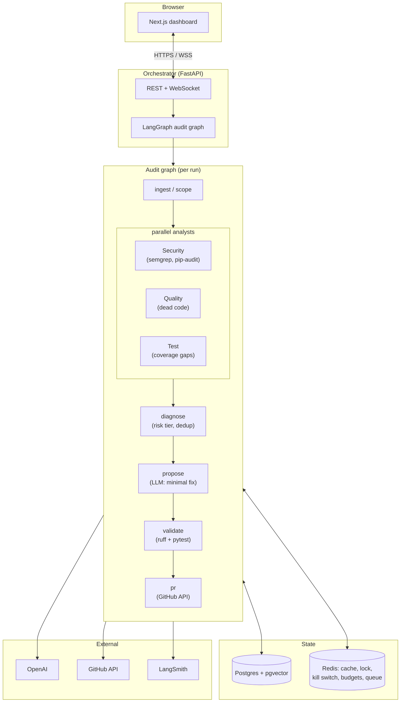

# Sentinel

**An AI engineer that audits a codebase and opens fix PRs — validated, explained, and never auto-merged.**

Sentinel is a multi-agent system built on LangGraph: three specialized agents (Security,
Quality, Test) investigate a repository in parallel, a lead process synthesizes their
findings by risk tier, and for each fixable issue Sentinel generates a patch, validates
it against the real codebase (lint + tests), and opens a real GitHub pull request with a
full writeup — evidence, reasoning, the fix, validation results. Nothing merges without a
human.

It's a small, self-contained system, but it exercises the actual hard part of production
AI engineering: an agent that takes **consequential, irreversible-adjacent actions on a
real environment** (branches, commits, pull requests) under real safety constraints —
spend caps, a kill switch, idempotency, a distributed lock, and a hard PR-only boundary
that no code path in this project can bypass.

---

## Why this project

Most LLM demos stop at "the model produced a plausible answer." Sentinel's premise is
that the interesting engineering problem starts *after* that — how do you let an agent
act on a system you actually care about, safely? Every design decision here is in service
of that question:

- The LLM **proposes**; deterministic code **enforces**. Risk tiers are assigned by rule,
  not model judgment. Every consequential action — a branch, a commit, a shell command, a
  file read — is gated by code the model can request but never bypass.
- Real bugs got hit and fixed during development, not hand-waved: an unbounded recursion
  limit that let an agent spin for 50+ tool calls with no cap, a prompt-leakage incident
  where an analyst reported something out of scope despite its own reasoning saying not
  to (caught safely by the human-review boundary — see `docs/design_decisions.md`), a
  real RCE-shaped input (git's `ext::` transport) closed before it ever shipped.
- Cost, safety, and correctness are load-bearing, not decorative: a per-audit spend cap
  is a genuine mid-run circuit breaker (raises the instant cost crosses the limit, not a
  log line after the fact), and a distributed lock prevents two concurrent workers from
  generating conflicting fixes for the same file — verified with real concurrent worker
  processes, not asserted.

---

## Architecture



Full diagram, component breakdown, and repository layout: [`docs/architecture.md`](docs/architecture.md).

---

## What it actually does

1. **Ingests** a repo — clones by GitHub URL or reads a local path, chunks Python files
   by function/class (AST-aware, not raw line windows), embeds into pgvector.
2. **Investigates** in parallel — Security Analyst runs real `semgrep` + `pip-audit` and
   interprets the output (never freehand-detects vulnerabilities); Quality Analyst finds
   dead code; Test Analyst finds coverage gaps. Every finding streams live to the
   dashboard over WebSocket as it happens.
3. **Diagnoses** — findings get a risk tier (`mechanical` vs `risky`) assigned
   deterministically, deduplicated against near-identical past findings via a semantic
   cache, and persisted to a queryable findings history.
4. **Proposes a fix** — a minimal, verified snippet-replace patch per fixable finding
   (not a raw diff an LLM could get the line offsets wrong on).
5. **Validates** — applies the patch to a local working copy just long enough to run
   `ruff` + `pytest` (a *regression* check against the file's pre-existing state, not an
   all-clean gate that would unfairly block a valid fix over unrelated lint debt), then
   reverts.
6. **Opens a PR** — entirely via the GitHub API, no local push credentials needed.
   Mechanical fixes open as normal PRs; risky (security) fixes open as **drafts**,
   labeled `needs-security-review`, regardless of validation status. Idempotent — running
   the same audit twice never opens a duplicate.

---

## Engineering highlights

- **Multi-agent orchestration** — LangGraph `StateGraph`, three analysts fanned out and
  joined, durable via a Postgres-backed checkpointer (worker-death recovery).
- **Real tool grounding** — the Security Analyst is grounded in actual SAST/dependency
  scanner output, not LLM pattern-matching on source code.
- **RAG with two caching layers** — a content-hash cache skips re-embedding unchanged
  code (verified: a repeat ingest does zero OpenAI calls), a semantic cache dedups
  near-duplicate findings via cosine similarity.
- **A real fallback chain** — model failures retry once on a cheaper model; network-tool
  failures (semgrep/pip-audit) retry with exponential backoff.
- **Production hardening** — a Redis task queue with a horizontally scalable worker pool,
  hard per-audit and daily spend caps, a distributed lock scoped precisely to the
  git-writing step, verified with real concurrent worker processes and no duplicate PRs.
- **Untrusted-input discipline applied consistently** — LLM output is never trusted for
  authorization (path-traversal checks, unique-snippet verification before any patch);
  user-pasted GitHub URLs get the same treatment (strict validation before ever reaching
  a subprocess, closing a real RCE-shaped vector in git's own URL syntax).
- **A dashboard that's a real product surface** — live multi-agent timeline, findings
  table with expandable diffs and validation status, audit-history trend chart, a kill
  switch wired to the real backend flag — not a bare API response dumped on screen.

Full write-up of every real bug hit and how it was fixed:
[`docs/design_decisions.md`](docs/design_decisions.md). Full LLM pipeline (models, prompts,
tools, safety-rail table): [`docs/ai_pipeline.md`](docs/ai_pipeline.md).

---

## Stack

| Layer | Choice |
|---|---|
| Agent orchestration | LangGraph, LangChain |
| LLM | OpenAI (mixed tier: cheap model for analysts/fixes, cheaper fallback on failure) |
| Vector store | Postgres + pgvector |
| Queue / cache | Redis (task queue, caching, locks, kill switch, spend budgets) |
| Security tools | semgrep, pip-audit (real tool output, LLM interprets/prioritizes) |
| Tracing | LangSmith |
| Metrics | Prometheus + Grafana |
| Frontend | Next.js (App Router), TypeScript, Tailwind, shadcn/ui, Recharts |
| Packaging | Docker Compose (infra); see [`docs/deployment_guide.md`](docs/deployment_guide.md) for the full cloud-deploy plan |

---

## Usage

```bash
cp .env.example .env   # OPENAI_API_KEY, GITHUB_TOKEN, LANGCHAIN_API_KEY
docker compose up -d   # postgres+pgvector, redis, prometheus, grafana
uv sync

uv run sentinel audit --repo .          # full multi-agent graph, CLI
uv run uvicorn sentinel.api:app --port 8000   # orchestrator API + WebSocket

cd frontend && cp .env.local.example .env.local && npm install && npm run dev
# open http://localhost:3000 — paste a GitHub URL or a local path, click Run audit
```

Full setup, conventions, and how to extend Sentinel with a new analyst:
[`docs/contributing.md`](docs/contributing.md).

---

## Project status

All initially planned development phases complete — foundations, single-agent investigation,
multi-agent orchestration, RAG & caching, fix generation with safeguards, production
hardening, and frontend polish. Phase 7 (deploy-readiness) is a written plan only
([`docs/deployment_guide.md`](docs/deployment_guide.md)) — nothing has been deployed to
the cloud; the point of that phase was confirming the architecture wouldn't need a
rewrite to get there.
