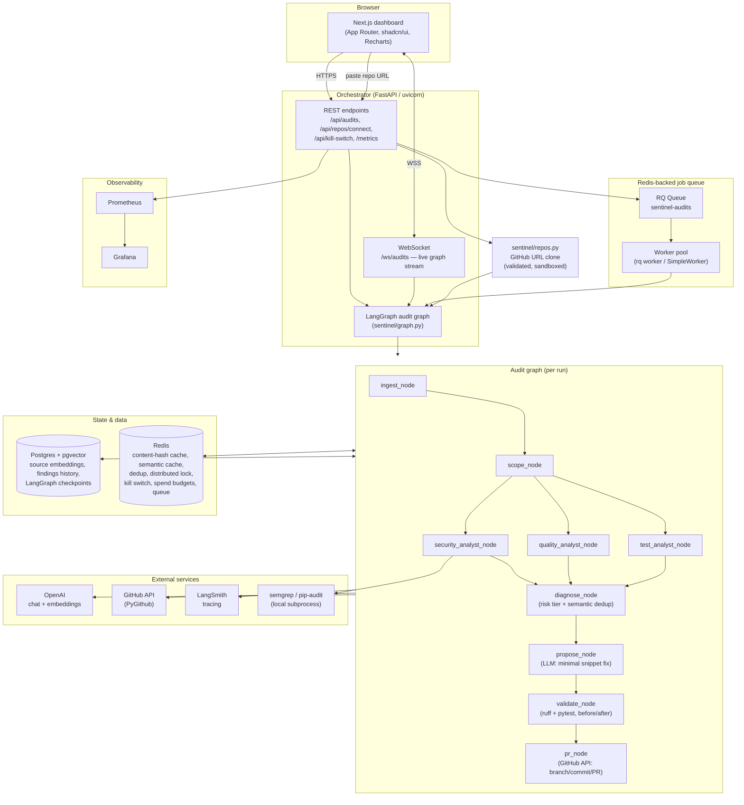

# Sentinel — Architecture

## System diagram



## Components

### Frontend (`frontend/`)
Next.js 16 (App Router), TypeScript, Tailwind, shadcn/ui, Recharts. Single-page dashboard:
landing/hero state before any audit, live timeline during a run (via WebSocket), findings
table with expandable diff/validation view, audit-history trend chart, kill-switch
control. No auth (deliberate scope decision — see `design_decisions.md`).

### Orchestrator (`sentinel/api.py`)
FastAPI service. Two ways to trigger an audit:
- `POST /api/audits` — synchronous, runs inline (FastAPI threadpools it since the handler
  is `def`, not `async def`).
- `WS /ws/audits` — same graph, streamed live via `astream()`, one frame per LangGraph
  node/tool-call update.
- `POST /api/audits/enqueue` + `GET /api/audits/jobs/{id}` — asynchronous via the RQ queue,
  for horizontal scaling across worker processes.

Also exposes `/health`, `/metrics` (Prometheus format), `/api/kill-switch`, and
`/api/repos/connect` (GitHub-URL onboarding).

### Audit graph (`sentinel/graph.py`, LangGraph `StateGraph`)
```
START → ingest → scope → [security_analyst, quality_analyst, test_analyst] (parallel)
      → diagnose → propose → validate → pr → END
```
- **ingest/scope**: resolve the repo path, walk the tree for Python files.
- **Security / Quality / Test analysts** (`sentinel/analysts.py`): three independent
  `langchain.agents.create_agent` tool-calling loops, run concurrently. See
  `ai_pipeline.md` for the full tool/model breakdown.
- **diagnose**: deterministic (no LLM call) — merges findings, assigns risk tier
  (`security` → `risky`, `quality`/`test` → `mechanical`), runs semantic-cache dedup,
  persists to findings history.
- **propose**: a plain structured-output LLM call per fixable finding (`sentinel/fixer.py`)
  — not an agent, no tools needed, given the finding + file content directly.
- **validate**: applies the proposed patch to the local clone's working tree just long
  enough to run `ruff` + `pytest`, then reverts (`sentinel/git_actions.py`).
- **pr**: branch/commit/PR entirely via the GitHub API (no local git push needed),
  gated by the distributed lock, idempotency dedup, and kill switch.

Durable via a Postgres-backed LangGraph checkpointer (`sentinel/durable.py`) on the
CLI/REST/queue path; the live WS path runs without a checkpointer for Windows
compatibility reasons (see `design_decisions.md`) but reconstructs final state
incrementally from the stream regardless.

### Data layer
- **Postgres + pgvector**: source-code embeddings (symbol-aware chunks), per-repo findings
  history, LangGraph checkpoints. Managed via `langchain-postgres` and
  `langgraph-checkpoint-postgres`.
- **Redis**: content-hash cache (skip re-embedding unchanged chunks), semantic cache
  (dedup near-duplicate findings), idempotency dedup keys, distributed lock (repo-scoped,
  PR-writing only), kill switch flag, daily spend counter, RQ job queue.

### External services
- **OpenAI** — chat models (analysts, fixer) and embeddings (ingest, semantic cache,
  findings history).
- **GitHub API** (PyGithub) — branch creation, file commits, PR creation. Also
  `git`/subprocess for local read-only operations (`git_diff`, repo cloning).
- **semgrep / pip-audit** — real SAST and dependency-CVE tools, invoked as subprocesses;
  the Security Analyst interprets and prioritizes their output rather than
  freehand-detecting vulnerabilities.
- **LangSmith** — full trace of every agent step, tool call, and token cost.

### Observability
Prometheus scrapes `/metrics` (cache hit/miss counters); Grafana visualizes it. LangSmith
covers agent-level tracing; structured JSON logs (stdout, `structlog`) carry a per-audit
correlation ID (`audit_id`) through every log line, queue job, and git action.

## Repository layout

```
sentinel/            Python backend package
  agent.py           Phase 1 single-agent path (kept for CLI `investigate`)
  analysts.py         Security/Quality/Test analyst agents + fallback chain
  api.py              FastAPI app: REST, WebSocket, kill-switch, metrics
  cache.py            Content-hash + semantic cache (Redis)
  cli.py               `sentinel ingest|query|investigate|audit` CLI
  config.py           Env-var settings
  cost.py             Spend budgets (per-audit hard cutoff, daily gate)
  dedup.py            Idempotency (PR dedup keys)
  durable.py          Postgres LangGraph checkpointer
  findings_store.py    Findings history (pgvector)
  fixer.py            Patch generation (structured-output LLM call)
  git_actions.py        GitHub API actions + local patch validation
  graph.py            The audit LangGraph + run_audit()/enqueue entrypoints
  ingest.py           Repo chunking + embedding pipeline
  killswitch.py        Redis-backed kill switch
  lock.py              Distributed lock (repo-scoped, PR-writing only)
  logging.py            Structured logging setup
  queue.py             RQ queue wrapper
  repos.py             GitHub-URL clone (validated, sandboxed)
  state.py             LangGraph state schema
  tools.py             Agent tools (file read, semgrep, pip-audit, git_diff, ...)

frontend/             Next.js dashboard
docs/                 This documentation
infra/                Prometheus config
docker-compose.yml    Infra services (Postgres, Redis, Prometheus, Grafana)
```
